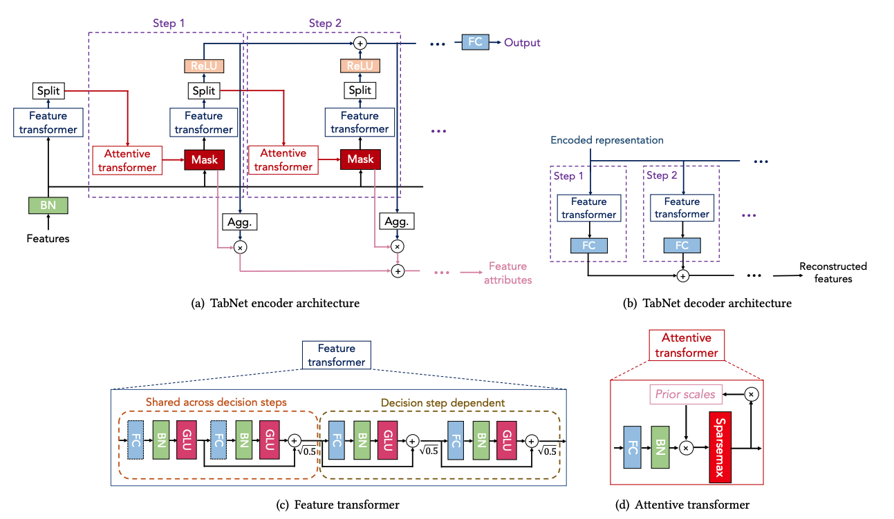
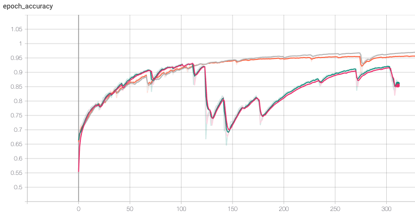

# TensorFlow TabNet

A TensorFlow 2.X implementation of the paper [TabNet](https://arxiv.org/abs/1908.07442).



TabNet is already available for TF2 [here](https://github.com/titu1994/tf-TabNet). However, an error in the batch normalizations of the shared feature transformer blocks makes it unable to learn. In the original code, only the fully connected layers weights are shared, not the batch normalizations which remain unique. When sharing the batch normalizations, training of TabNet on the datasets & hyperparameters of the original paper yields extremely bad results (if able to learn at all).

Moreover, the implementation uses `virtual_batch_size` from `tf.keras.layers.BatchNormalization` which has a couple of major issues:
- Less updates of the batch normalizations with respect to a vanilla Ghost Batch Normalization. Which makes the training unstable and longer.
- Does not allow batch size which can't be divided by the virtual batch size used during training (even for inference which should be independent of batch size).

Below is a plot of the training accuracy for a model trained with a true Ghost Batch Normalization and one trained with the incorrect `virtual_batch_size` argument from Keras:



Probably not aware of the issues introduced above, the implementation proposes to use [Group Normalization](https://arxiv.org/abs/1803.08494) instead of [Ghost Batch Normalization](https://arxiv.org/abs/1705.08741) which does make things better and able to learn. However, no comparision of the results obtained is proposed. Are they even close to the original ones? Can the model really generalize and obtain state of the art results?

Therefore, a new correct and tested TF2 implementation of TabNet is proposed. It not only ports the original code but take advantage of TF2 modular approach to make it easier to finetune and train a TabNet model on different tasks.

Currently in development but can already be used.

## Setup

### Install
Since this project is still under development, it is best to install it from the repo directly as follow:

```bash
pip install git+https://github.com/ostamand/tensorflow-tabnet.git
```

You can then import & train a classifier using:

```python
from tabnet.modeles.classify import TabNetClassifier
```

### For development

```bash
python -m venv venv
source venv/bin/activate
chmod +x scripts/install.sh; ./scripts/install.sh
```

## Dataset
- http://archive.ics.uci.edu/ml//datasets/Covertype
- https://www.kaggle.com/uciml/forest-cover-type-dataset/data#

## Reference
- [TabNet paper](https://arxiv.org/abs/1908.07442)
- [original TF1 code base](https://github.com/google-research/google-research/tree/master/tabnet)